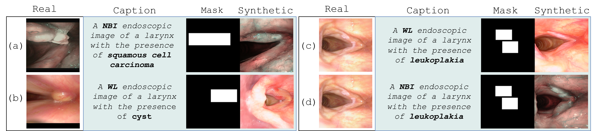

# Latent Diffusion Model + ControlNet for RGB Endoscopic Laryngeal Image-Annotation Pairs Generation

Script to train a Latent Diffusion generative model conditioning by ControlNet (from [Adding Conditional Control to Text-to-Image Diffusion Models](https://arxiv.org/abs/2302.05543))
on RGB laryngeal endoscopic dataset to obtain new image-annotation pairs ready to use fo enriching existing datasets, boosting the performance of CADe/x models. 




## Instructions

### Preprocessing
After preparing the dataset (imgs, masks, captions), we obtain the list of the paths for the laryngeal images and corresponding additional information (masks, capions). For that, we use the following script:

1) python3 `./src/python/preprocessing/create_datalist.py` -  Create files with datalist for training, validation and test.

### Training
After we obtain the paths, we can train the models using similar commands as in the following files:

2) `./src/scripts/training/stage1.sh` - Command to start to execute the training of the first stage of the model (if not using autoencoders from publicly available repositories). 
The main python script for this stage is the `./src/python/training/train_aekl.py` script. The `.sh` file specifies training parameters, configuration files, and output directories.
3) `./src/scripts/training/ldm.sh` - Command to start to execute the training the diffusion model on the latent representation.
The main python script for this stage is the `src/python/training/train_ldm.py` script.
4) `./src/scripts/training/controlnet.sh` - Command to start to execute the training the ControlNet model using the pretrained LDM.
The main python script for this stage is the `./src/python/training/train_controlnet.py` script. 

### Inference and evaluation
Finally, we can generate images from the fine-tuned diffusion model with controlnet, and compute some evaluation metrics. The following is the list of execution for inference and evaluation:

5) python3 `./src/python/testing/run_controlnet_inference.py` - Generate a new endoscopic laryngeal images from the diffusion model using contditioning.
6) python3 `./src/python/testing/fid_ratio.py` - Compute FID ratio between real and generated images.

## Authors
Chiara Baldini , [chiara.baldini@iit.it]

## Acknowledgments
* This code was built by adapting the version of [Osuala et al.](https://github.com/RichardObi/ccnet). We thank the authors for sharing the codes.

## Citation
If our code is helpful to you, please cite:

```

```
